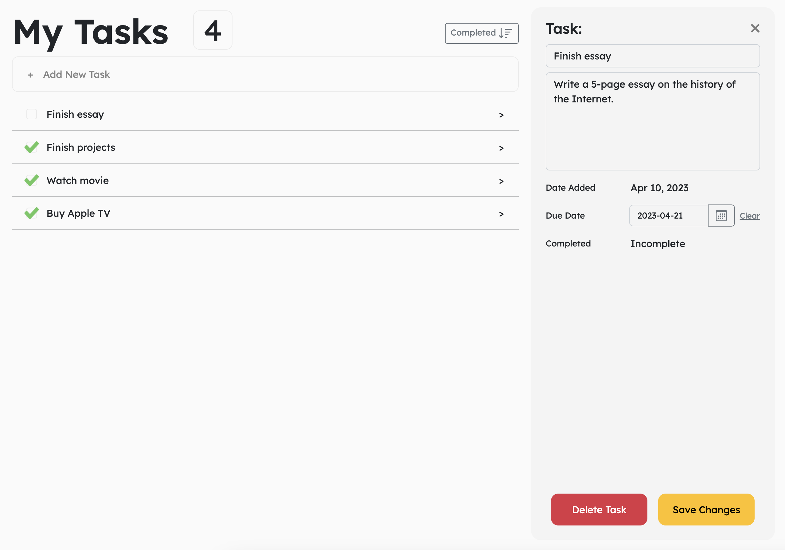
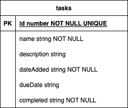

# Task Ninja

This project was generated with [Angular CLI](https://github.com/angular/angular-cli) version 15.2.4.

This To-Do List Web Application is designed to help you stay organized and on track with your daily tasks.

With this app, you can easily add tasks, set their priority and completion status, edit or delete tasks as needed, and sort tasks by different criteria.

## Getting Started

### Prerequisites

- Node.js (v17.5 or later)
- Git

### Installation

1. Open your favorite terminal and copy the following commands step by step:

2. Clone the repository:

`git clone git@github.com:JAW5RG3_thdgit/Task-Ninja.git`

3. Change directory into the project folder:

`cd Task-Ninja`

4. Install the necessary dependencies:

`npm install`

### Running the server

To start the server, run the following commands:
`npm run start-server`

This will run a concurrently script to start the JSON server and make it available at http://localhost:3000, as well as 
start the angular http server at http://localhost:4200

### Interacting with the server

Navigate to `http://localhost:4200` to interact with the application

You can also interact with the server using RESTful API calls
The JSON server will automatically serve data from the db.json file in the project directory.

- For example, to retrieve all the data from the server, use the following URL in your browser:

`http://localhost:3000/tasks`

## Built With

- Angular
- Node.js
- json-server
- concurrently
- Angular Bootstrap CSS

## Project Resources

- [Trello Board](https://trello.com/invite/b/iHVE1jYV/ATTI9ded5ae585082e9ab6385969ffad788828EA5983/angular-tdl)

## Database Schema

- **id**: a unique identifier for each task
- **name**: the title or name of the task
- **description**: a brief description or details about the task
- **dateAdded**: a field indicating the date which task was added
- **dueDate**: a field indicating the date which the task is due
- **completed**: a field indicating whether this task is completed or not
